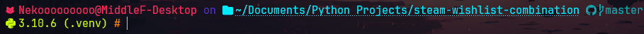
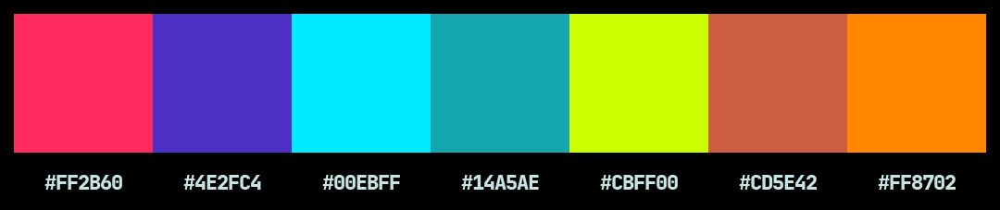

# My oh-my-posh theme

My personal config and oh-my-posh theme modified from [amro](https://github.com/JanDeDobbeleer/oh-my-posh/blob/main/themes/amro.omp.json) theme



## Colors

Based from [laser-theme](https://github.com/j0hnm4r5/laser-theme/blob/master/README.md)



## Config

### Powershell

<div style="text-align: right; font-size: 0.75em;"> Micosoft.PowerShell_profile.ps1 </div>

```powershell
oh-my-posh init pwsh --config "$env:POSH_THEMES_PATH/nekooooooooo.omp.toml" | Invoke-Expression
# Import the Chocolatey Profile that contains the necessary code to enable
# tab-completions to function for `choco`.
# Be aware that if you are missing these lines from your profile, tab completion
# for `choco` will not function.
# See https://ch0.co/tab-completion for details.
$ChocolateyProfile = "$env:ChocolateyInstall\helpers\chocolateyProfile.psm1"
if (Test-Path($ChocolateyProfile)) {
  Import-Module "$ChocolateyProfile"
}
$env:VIRTUAL_ENV_DISABLE_PROMPT=1
```

### Lua

<div style="text-align: right; font-size: 0.75em;"> oh-my-posh.lua </div>

```lua
load(io.popen('oh-my-posh init cmd --config %POSH_THEMES_PATH%/nekooooooooo.omp.toml'):read("*a"))()
```